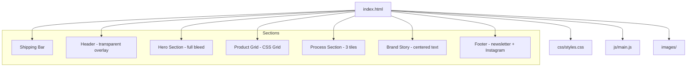
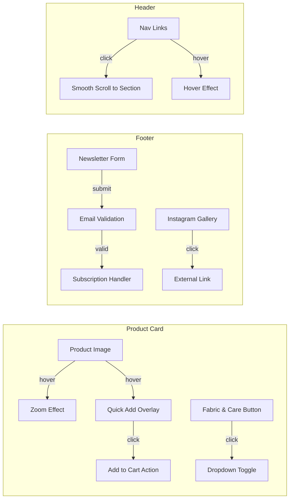

# Design Document: Unwritten Fashion Website

## Overview

This design describes a single-page e-commerce landing page for "unwritten," a South African artisanal slow fashion brand. The page is built as a static HTML/CSS/JS site embodying romantic minimalism — ethereal, airy, and clean. It features a shipping bar, transparent header, full-bleed hero, responsive product grid with interactive cards, a craftsmanship process section, brand story, and a footer with newsletter signup and Instagram gallery. All pricing is in ZAR (R#,###.00).

The site is purely front-end: HTML5 for structure, CSS3 (with CSS Grid and custom properties) for layout and theming, and vanilla JavaScript for interactivity (dropdown toggles, hover overlays, newsletter form handling). No frameworks or build tools are required — the goal is a lightweight, fast-loading boutique experience.

## Architecture

The application follows a simple static site architecture:

```
index.html          — Single page with all sections
css/
  styles.css        — All styles (variables, layout, components, responsive)
js/
  main.js           — Interactivity (dropdown, quick-add overlay, form handling)
images/             — Hero, product, process, and Instagram images
```



### Key Architectural Decisions

1. **No framework** — A single landing page doesn't warrant React/Vue overhead. Vanilla HTML/CSS/JS keeps it fast and simple.
2. **CSS Custom Properties** — Brand palette and spacing tokens defined as CSS variables for consistency and easy theming.
3. **CSS Grid for product layout** — Native grid handles the 4→2 column responsive breakpoints cleanly.
4. **Google Fonts** — Cormorant Garamond and Inter loaded via `<link>` tags.
5. **Semantic HTML** — `<header>`, `<main>`, `<section>`, `<footer>`, `<nav>` for accessibility and SEO.

## Components and Interfaces

### 1. Shipping Bar
- Thin banner at the very top of the page
- Static text: "Courier delivery across South Africa | Free for orders over R2,000"
- Deep Charcoal text on Soft Bone background
- Always visible above the header on all viewports

### 2. Header
- Positioned over the Hero Section with `position: absolute` and transparent background
- Brand logo "unwritten" centered, using Cormorant Garamond
- Navigation links: "Shop," "Process," "Our Story" — using Inter/Montserrat
- Hover effects on nav links (color change or underline, 200-400ms transition)
- Mobile (< 768px): collapses to a hamburger menu or simplified layout

### 3. Hero Section
- Full viewport width, large background image (natural South African landscape)
- Soft overlay/gradient for text readability
- Headline: "Grace Looks Good On You" — Cormorant Garamond
- Sub-headline: "Handcrafted slow fashion for the intentional woman"
- Tagline: "Unwritten, but not untold."
- Scales proportionally on mobile

### 4. Product Grid
- CSS Grid container
- Desktop (≥ 1024px): 4 columns
- Tablet (768px–1023px): 2 columns
- Mobile (< 768px): 2 columns
- Consistent gutters and section padding (80-120px vertical)

### 5. Product Card
- Image, product name, price (ZAR format: R#,###.00)
- Hover: subtle zoom on image (or second image reveal) + Quick Add overlay fade-in
- Typography: Inter/Montserrat for name and price
- Quick Add Overlay: appears on hover with a fade-in transition (200-400ms)

### 6. Fabric & Care Dropdown
- Expandable/collapsible section on product cards or detail views
- Click to toggle open/closed
- Displays fabric composition and care instructions
- Emphasizes natural, high-quality materials

### 7. Process Section ("The Art of the Stitch")
- Title: "The Art of the Stitch"
- 3 image-heavy tiles in a row on desktop
  - Tile 1: "CAD Patterns and sketches"
  - Tile 2: "Fabric Selection" — rolls of floral/pastel fabrics
  - Tile 3: Designer at work in studio
- Mobile (< 768px): tiles stack vertically

### 8. Brand Story Section ("More Than Just a Brand")
- Title: "More Than Just a Brand" — Cormorant Garamond
- Centered narrow text block (max-width ~700px) for comfortable reading
- Soft storytelling tone about quality and South African craftsmanship
- Body text: Inter/Montserrat

### 9. Footer
- Newsletter Signup: heading "Join the Journey," email input + submit button
- Instagram Gallery: horizontal row of 4 lifestyle images, "Follow our journey" CTA
- Sage Green (#98A68E) accent on interactive elements
- Responsive: stacks on mobile


### Component Interaction Diagram



## Data Models

Since this is a static landing page, data is embedded directly in the HTML or defined as JavaScript objects. No backend or database is involved.

### Product Data Structure

```javascript
// Each product in the grid
const product = {
  id: string,           // Unique identifier, e.g., "linen-wrap-dress"
  name: string,         // Display name, e.g., "Linen Wrap Dress"
  price: number,        // Price in cents (ZAR), e.g., 149900 for R1,499.00
  image: string,        // Primary image path
  hoverImage: string,   // Secondary/lifestyle image path (optional)
  fabric: string,       // Fabric composition, e.g., "100% French Linen"
  care: string[],       // Care instructions, e.g., ["Hand wash cold", "Lay flat to dry"]
};
```

### Currency Formatting

```javascript
// Formats a price in cents to ZAR display string
// formatZAR(149900) → "R1,499.00"
function formatZAR(priceInCents) {
  const rands = priceInCents / 100;
  return `R${rands.toLocaleString('en-ZA', { minimumFractionDigits: 2, maximumFractionDigits: 2 })}`;
}
```

### Process Tile Data

```javascript
const processTile = {
  title: string,    // e.g., "CAD Patterns and sketches"
  image: string,    // Image path
  alt: string,      // Alt text for accessibility
};
```

### Instagram Gallery Item

```javascript
const instagramItem = {
  image: string,    // Image path
  alt: string,      // Alt text
  link: string,     // Instagram post URL
};
```

### CSS Custom Properties (Design Tokens)

```css
:root {
  /* Colors */
  --color-bone: #F9F8F4;
  --color-sage: #98A68E;
  --color-rose: #DCAE96;
  --color-charcoal: #2C2C2C;

  /* Typography */
  --font-heading: 'Cormorant Garamond', serif;
  --font-body: 'Inter', 'Montserrat', sans-serif;

  /* Spacing */
  --section-padding: 100px;
  --grid-gap: 24px;

  /* Transitions */
  --transition-hover: 300ms ease;
}
```


## Correctness Properties

*A property is a characteristic or behavior that should hold true across all valid executions of a system — essentially, a formal statement about what the system should do. Properties serve as the bridge between human-readable specifications and machine-verifiable correctness guarantees.*

### Property 1: ZAR Currency Formatting Round-Trip

*For any* non-negative integer representing a price in cents, `formatZAR` should produce a string that starts with "R", uses comma-separated thousands, and ends with exactly two decimal places. Furthermore, parsing the numeric portion of the formatted string back to cents should yield the original value.

**Validates: Requirements 5.2, 14.1, 14.2, 14.3**

### Property 2: Product Card Data Completeness

*For any* product object with valid `name`, `price`, and `image` fields, rendering a Product Card from that object should produce HTML containing an `` element with the product image source, the product name as text content, and the formatted ZAR price string.

**Validates: Requirements 5.1**

### Property 3: Fabric & Care Dropdown Toggle Round-Trip

*For any* Fabric & Care Dropdown in its initial collapsed state, clicking it once should make the content visible (expanded), and clicking it a second time should return it to the collapsed state, identical to the initial state.

**Validates: Requirements 8.1, 8.2**

### Property 4: Typography Consistency

*For any* heading element (h1, h2, h3) on the page, the computed `font-family` should include "Cormorant Garamond". *For any* body text or UI element (paragraphs, links, buttons, input labels), the computed `font-family` should include "Inter" or "Montserrat".

**Validates: Requirements 10.5, 10.6**

### Property 5: Section Vertical Padding

*For any* major section element on the page (Product Grid, Process Section, Brand Story, Footer), the computed vertical padding (top + bottom) should each be between 80px and 120px inclusive.

**Validates: Requirements 11.1**

### Property 6: Product Grid Consistent Gutters

*For any* pair of adjacent Product Card elements within the Product Grid, the gap between them should be equal to the grid's configured gap value, ensuring uniform spacing throughout.

**Validates: Requirements 4.5, 11.3**

### Property 7: No Horizontal Overflow at Minimum Viewport

*For any* text or content element on the page, when the viewport width is set to 320px, the element's right edge should not exceed the viewport width (no horizontal scrollbar).

**Validates: Requirements 12.2**

### Property 8: Minimum Tap Target Size

*For any* interactive element (buttons, links, form inputs) on the page, the rendered dimensions should be at least 44px × 44px to meet touch accessibility requirements.

**Validates: Requirements 12.3**

### Property 9: Hover Transition Duration Range

*For any* element on the page that has a CSS `transition` property defined for hover effects, the `transition-duration` value should be between 200ms and 400ms inclusive.

**Validates: Requirements 13.4**

## Error Handling

Since this is a static front-end landing page with no backend, error handling is minimal but still important:

### Newsletter Form
- **Empty email submission**: Prevent form submission if the email input is empty. Display inline validation message.
- **Invalid email format**: Use HTML5 `type="email"` validation plus a regex check. Show a user-friendly error message below the input.
- **Successful submission**: Show a confirmation message (e.g., "Thank you for joining the journey.") since there's no backend, this is a UI-only acknowledgment.

### Image Loading
- **Failed image loads**: Use `alt` text on all `` elements so content remains accessible if images fail to load.
- **Lazy loading**: Use `loading="lazy"` on below-the-fold images (product grid, process tiles, Instagram gallery) to improve performance.

### Dropdown Toggle
- **Rapid clicking**: The toggle function should be idempotent per click — no broken states from rapid toggling. Use a simple class toggle rather than complex state management.

### Font Loading
- **Google Fonts failure**: Specify fallback fonts in the CSS font stack (`serif` for Cormorant Garamond, `sans-serif` for Inter/Montserrat) so the page remains readable if external fonts fail to load.

### Responsive Edge Cases
- **Very narrow viewports (< 320px)**: Content should still be usable, even if not pixel-perfect. No content should be clipped or hidden.
- **Very wide viewports (> 1920px)**: Use `max-width` on the main content container to prevent the layout from stretching uncomfortably wide.

## Testing Strategy

### Unit Tests

Unit tests verify specific examples, edge cases, and structural correctness:

- **Shipping bar**: Verify exact text content, DOM position above header, correct colors.
- **Header**: Verify logo text, nav link labels ("Shop", "Process", "Our Story"), transparent background style.
- **Hero section**: Verify headline, sub-headline, and tagline text content. Verify full-width styling.
- **Product grid**: Verify 4-column layout at 1024px+, 2-column at 768px-1023px, 2-column below 768px.
- **Product card**: Verify hover overlay appears, zoom effect CSS is applied.
- **Process section**: Verify title text, 3 tiles present, correct tile labels.
- **Brand story**: Verify title text, max-width constraint, centered alignment.
- **Footer**: Verify newsletter heading, email input presence, submit button, 4 Instagram images, "Follow our journey" CTA.
- **Color palette**: Verify body background is #F9F8F4, text color is #2C2C2C, accent elements use #98A68E and #DCAE96.

### Property-Based Tests

Property-based tests use a library like **fast-check** (JavaScript) to verify universal properties across many generated inputs. Each test runs a minimum of 100 iterations.

Each property test references its design document property:

1. **Feature: unwritten-fashion-website, Property 1: ZAR Currency Formatting Round-Trip** — Generate random non-negative integers, format with `formatZAR`, verify format regex `^R\d{1,3}(,\d{3})*\.\d{2}$`, and verify round-trip back to original value.

2. **Feature: unwritten-fashion-website, Property 2: Product Card Data Completeness** — Generate random product objects with arbitrary names, prices, and image paths. Render to HTML string and verify it contains the image src, name text, and formatted price.

3. **Feature: unwritten-fashion-website, Property 3: Fabric & Care Dropdown Toggle Round-Trip** — For generated dropdown instances, simulate click → verify expanded, click again → verify collapsed matches initial state.

4. **Feature: unwritten-fashion-website, Property 4: Typography Consistency** — Query all heading and body text elements, verify computed font-family matches expected values.

5. **Feature: unwritten-fashion-website, Property 5: Section Vertical Padding** — Query all major section elements, verify computed padding-top and padding-bottom are each within [80, 120] px.

6. **Feature: unwritten-fashion-website, Property 6: Product Grid Consistent Gutters** — Render grids with varying numbers of product cards, verify all gaps between adjacent cards are equal.

7. **Feature: unwritten-fashion-website, Property 7: No Horizontal Overflow at Minimum Viewport** — At 320px viewport, query all elements and verify none exceed viewport width.

8. **Feature: unwritten-fashion-website, Property 8: Minimum Tap Target Size** — Query all interactive elements (a, button, input), verify each has dimensions ≥ 44×44px.

9. **Feature: unwritten-fashion-website, Property 9: Hover Transition Duration Range** — Query all elements with transition properties, verify duration values are between 200ms and 400ms.

### Testing Library

- **Property-based testing**: `fast-check` (npm package for JavaScript)
- **Test runner**: Jest or Vitest
- **DOM testing**: jsdom (for rendering HTML and checking computed styles in unit/property tests)
- Each property-based test MUST run a minimum of 100 iterations
- Each property-based test MUST be tagged with a comment: `// Feature: unwritten-fashion-website, Property N: <property title>`
